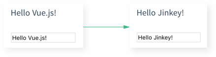
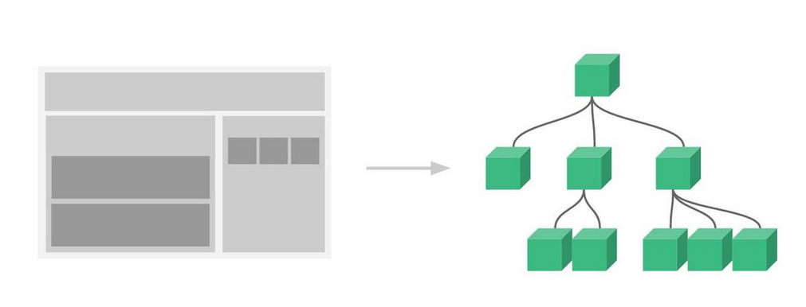

# Vue 介绍

## 什么是 Vue

Vue是一个前端框架,特点是
- 数据绑定:  
  比如当你改变输入框Input的标签值,会自动同步更新到页面上其他绑定该输入框组件的值
  

- 组件化:  
  页面上每一个按钮都可以是一个单独的文件.vue, 这些小的组件可以直接像乐高积木一样通过互相引用而组装起来
  

## Vue2 推荐的一些开发环境

- Homebrew: 对于Mac系统,这个是一个很好的包管理器,类似于Linux的apt-get或者Windows的控制面板,用于安装删除应用程序
- Node.js：JS运行环境
- npm：Nodejs的包管理器
- webpack：Vue的组件都是通过.vue或者例如微信小程序的.wxml or .wxss等自定义的组件无法被用户端的浏览器解析，这时候需要webpack进行翻译和打包成.js文件
- vue-cli: 这个可以用来生成模板的Vue工程，相当于按照设计好的图纸来建房子，就是封装了类似的脚手架

## Vue的安装方式

### 安装Node.js
  - 安装NVM:  
    1. 下载 NVM 安装包：访问 NVM for Windows GitHub页面，选择 nvm-setup.exe 或 nvm-setup.zip 文件下载。
    2. 运行安装程序：双击 nvm-setup.exe 文件，按照提示进行安装。您可以选择安装路径，这里假设安装路径为 C:\NVM。
    3. 验证安装: 安装完成后，系统环境变量中会新增两个变量 ->
       - NVM_HOME: 存储 NVM 的根路径。
       - NVM_SYMLINK: 存储当前使用的 Node.js 的符号链接路径。  
    Note: PATH 环境变量中会自动添加 %NVM_HOME% 和 %NVM_SYMLINK%，您可以直接使用 nvm 命令。
    4. 检查 NVM 版本：打开命令提示符，输入以下命令查看 NVM 版本：
   
    ```shell
     nvm version
    ```

  - 使用 NVM 安装 Node.js
    1. 查看可用的 Node.js 版本
    ```shell
     nvm list available
    ```
    2. 安装 Node.js
        您可以选择三种方式来安装 Node.js：
        - 安装最新版本：nvm install node
        - 安装最新 LTS 版本：nvm install --lts
        - 安装指定版本：nvm install <version>
    3. 验证 Node.js 安装
       - 检查 Node.js 版本   
        ```shell
         node -v
        ```
       - 检查 npm 版本   
        ```shell
         npm -v
        ```

### 安装 Vue
- 检查node和npm是否安装成功
  ```shell
  node -V
  npm -V
  ```
  这两个指令之后出现安装信息即为安装成功
- 安装 vue-cli 和 webpack
  ```shell
  npm install vue-cli -g
  npm install webpack -g
  ```
  到这里环境就安装成功了，如果没有反应，请尝试淘宝或清华源镜像进行加速

### 创建 vue2.x 工程文件
- 根据模板创建项目
  ```shell
    vue init webpack-simple <NAME>
    npm install
    npm install vue-router vue-resource --save
    npm run dev
  ```

### 常见的依赖安装语句
```shell
axios: npm install axios
element-ui: npm i element-ui --save
vue-router: npm install vue-router --save
vuex: npm install vuex --save

富文本插件
mavon-editor: npm install mavon-editor --save
markdown-it: npm install markdown-it --save
github-markdown-css： npm install markdown-it --save

echarts封装版本
VCharts: npm install v-echarts echarts --save
```