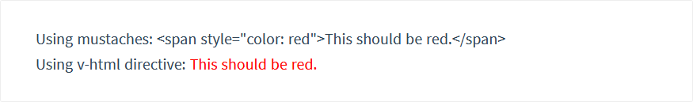

# 02-插值语法

## 文本

- 双大括号文本插值
  数据绑定最常见的形式就是双大括号，也被称作Mustache语法的文本插值

```html
<span>Message: {{ msg }}</span>
```
通过这个标签，Mustache标签会被代替为对应数据对象上property的值。当绑定的数据对象上的property改变，插值处的内容会被更新

- v-once指令
使用v-once指令，我们可以一次性的插值。当数据改变时，插值处的内容不会被更新。然而这个会影响到该节点上其他数据绑定
```html
<span v-once> {{msg}} <span>
```

- v-html指令
上述两个方法都会把数据解释成为普通文本而不是HTML代码。为了输出真正的HTML代码，我们需要使用v-html指令

```html
<!--我们假设rawHtml的值为<span style="color:red">This should be red. </span></span>-->
<p>Using mustaches: {{ rawHtml }}</p>
<p>Using v-html directive: <span v-html="rawHtml"></span></p>
```

我们会得到



**注意！！！！！**：在任何网站上动态渲染HTML会非常危险，容易导致XSS攻击，绝对不要对用户提供的内容使用插值语法